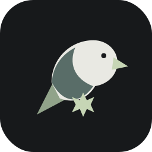
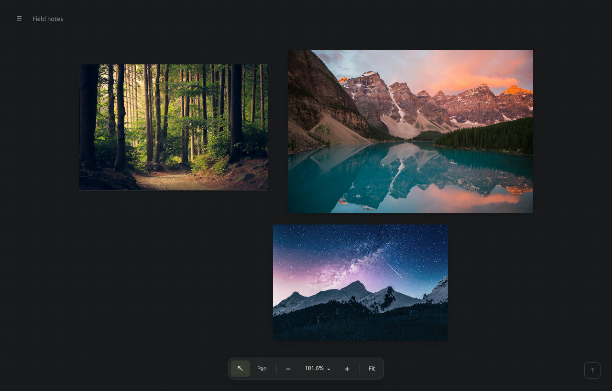
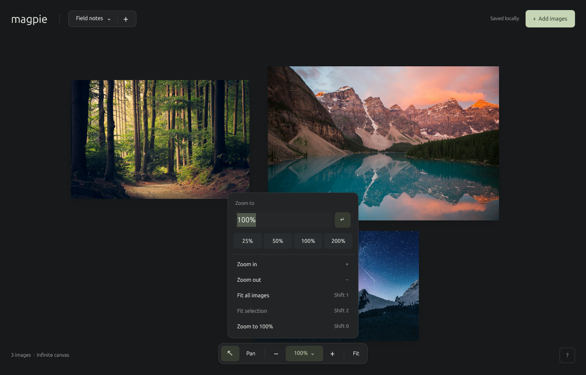
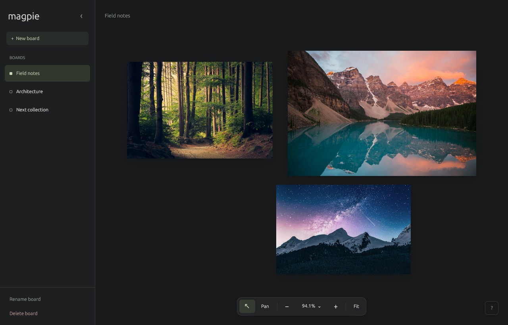
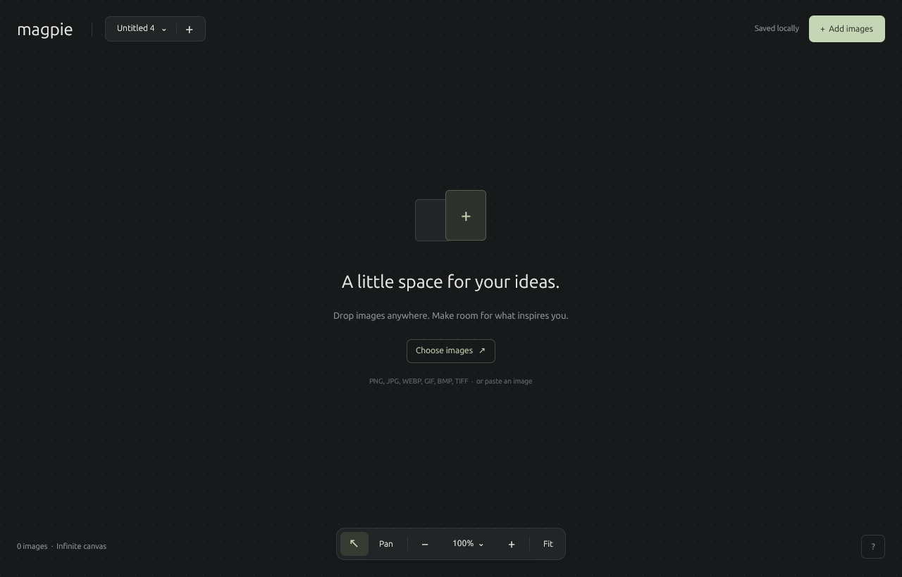

# Magpie

[](https://github.com/LachyFS/magpie/actions/workflows/ci.yml)
[](https://github.com/LachyFS/magpie/releases/latest)

Collect what catches your eye. A native mood board app built in **Rust + GPUI**, with a dark infinite canvas and just a few floating controls.

[](https://github.com/LachyFS/magpie/releases/download/v0.1.3/magpie-0.1.3-macos-aarch64.dmg)
[](https://github.com/LachyFS/magpie/releases/download/v0.1.3/magpie-0.1.3-linux-x86_64.deb)
[](https://github.com/LachyFS/magpie/releases/download/v0.1.3/magpie-0.1.3-windows-x86_64.zip)

[macOS Intel](https://github.com/LachyFS/magpie/releases/download/v0.1.3/magpie-0.1.3-macos-x86_64.dmg) · [Linux portable](https://github.com/LachyFS/magpie/releases/download/v0.1.3/magpie-0.1.3-linux-x86_64.tar.gz)



## Download

**[Download the latest release](https://github.com/LachyFS/magpie/releases/latest)** — no Rust toolchain required.

| Platform | Download | Install |
| --- | --- | --- |
| Linux x86-64 | `magpie-VERSION-linux-x86_64.deb` | `sudo apt install ./magpie-*.deb`, then open Magpie from your app launcher |
| Linux x86-64, portable | `magpie-VERSION-linux-x86_64.tar.gz` | Extract and run `./magpie` from the extracted folder |
| macOS Apple Silicon | `magpie-VERSION-macos-aarch64.dmg` | Open the disk image and drag Magpie into Applications |
| macOS Intel | `magpie-VERSION-macos-x86_64.dmg` | Open the disk image and drag Magpie into Applications |
| Windows x86-64 | `magpie-VERSION-windows-x86_64.zip` | Extract the ZIP and open `magpie.exe` |

Linux packages target Ubuntu 22.04+/Debian 12+ or compatible distributions and require a Vulkan-capable graphics driver. The portable archive also needs the runtime libraries listed in [release documentation](docs/RELEASING.md#linux-runtime). macOS packages require macOS 11 or later. Windows packages target Windows 10/11.

The macOS app has an ad-hoc signature and is not Apple-notarized. The Windows app is not Authenticode-signed. These initial builds can trigger your OS's downloaded-app prompts; see [Apple's instructions for opening a trusted app](https://support.apple.com/en-us/102445).

Every release includes `SHA256SUMS.txt`. Verify a download with `sha256sum --check --ignore-missing SHA256SUMS.txt` on Linux, `shasum -a 256 FILE` on macOS, or `Get-FileHash FILE -Algorithm SHA256` in PowerShell, comparing the result with the corresponding checksum.

## Screenshots

Zoom smoothly around the pointer, enter an exact percentage, or jump straight to your selection:



Switch boards or start a new collection in one click:



<details>
<summary>A fresh canvas</summary>



</details>

These are captures of the running app. [Demo photo credits and screenshot instructions](docs/SCREENSHOTS.md).

## Build from source

```sh
git clone https://github.com/LachyFS/magpie.git
cd magpie
./run.sh
# You can also open images from the command line:
./run.sh ~/Pictures/reference.jpg ~/Pictures/palette.png
```

The Rust toolchain is pinned in `rust-toolchain.toml`; rustup installs it automatically. On Linux, GPUI needs a Vulkan-capable graphics driver and the X11/Wayland development libraries. On Ubuntu/Debian:

```sh
sudo apt install build-essential pkg-config libxcb1-dev libxkbcommon-dev libxkbcommon-x11-dev libwayland-dev libfontconfig1-dev libfreetype-dev libssl-dev
```

You can also use `cargo run --locked` directly. The launch script adds Rust's default installation directory to `PATH` and uses optional local Linux libraries from `.local/` when present. The checked-in lockfile retains libc 0.2.186 for compatibility with GPUI's transitive xattr dependency.

GitHub Actions builds Linux, macOS (both architectures), and Windows packages. Linux also runs the native end-to-end smoke test. macOS needs full Xcode with Metal command-line tools; Windows needs the MSVC toolchain and Windows SDK shader compiler. On Windows, launch development builds with `cargo run --locked`.

For an optimized local build, use `cargo build --release --locked` and run `target/release/magpie` (`magpie.exe` on Windows). [Packaging and release instructions](docs/RELEASING.md).

## Using the canvas

- Drop one or several image files anywhere, press **Ctrl/Cmd+O**, or paste a copied image. Imports preserve originals and create bounded previews in the background.
- Drag an image to move it. Select one image and drag its bottom-right handle to resize while preserving its aspect ratio.
- Drag empty space to pan. Hold Space to pan from anywhere. Mouse-wheel and two-finger scrolling also pan; Shift+wheel pans horizontally. Hold Ctrl/Cmd while scrolling to zoom around the pointer. On macOS, pinch the trackpad to zoom.
- Shift-click images to select several, or Shift-drag empty space to draw a selection rectangle.
- Use **+ New board** in the left sidebar to start a collection, then click a board to switch. Rename and delete actions sit at the bottom of the sidebar. Collapse it with **‹**, and reopen it with **☰** or **Ctrl/Cmd+B**. Deleted boards and images can be restored with Undo during the same session.
- A small spinner appears during imports and saving; the canvas stays free of status text when idle.
- Click the zoom percentage to enter any scale or pick a preset. The **− / +** buttons ease between useful steps; **Fit** brings all images into view. Fit selection keeps your selection intact.
- Zoom keeps going far beyond ordinary presets, from **0.0000001% to 100,000,000,000%**. These are numerical safety bounds, not literal infinite precision. The grid adapts at every scale, and camera/image coordinates use double precision.
- The **?** button shows keyboard shortcuts.

| Action | Shortcut |
| --- | --- |
| Toggle boards sidebar | Ctrl/Cmd+B |
| New board | Ctrl/Cmd+N |
| Import images | Ctrl/Cmd+O |
| Paste image | Ctrl/Cmd+V |
| Select all | Ctrl/Cmd+A |
| Duplicate selection | Ctrl/Cmd+D |
| Delete selection | Delete / Backspace |
| Undo / redo | Ctrl/Cmd+Z / Ctrl/Cmd+Shift+Z |
| Zoom in / out | + / −, or Ctrl/Cmd + / − |
| Fit all images | Shift+1 / F |
| Fit selection | Shift+2 |
| Reset zoom to 100% | Shift+0 / 0 |
| Select / pan tool | V / H |
| Rename board | F2 |
| Deselect / close overlay / cancel move | Escape |

## Your files

Everything stays local. Boards and camera positions save automatically to `boards.json`; originals and previews live in the adjacent `images/` directory. Source files can be moved or deleted after import. Saves use a temporary file and atomic replacement; an unreadable library causes a startup error instead of being overwritten.

The default location follows the OS app-data convention (`~/.local/share/magpie` on Linux). Set `MAGPIE_DATA_DIR=/some/folder` for a separate library, or copy the entire data folder to back it up. Image assets are retained after deletion so undo never breaks; automatic cleanup is not implemented yet. Each library is locked while open, so two instances cannot overwrite one another.

PNG, JPEG, WebP, GIF, BMP, and TIFF are supported. GIFs use a still preview. The initial version does not include URL imports, notes, collaboration, or board export.

## Development

```sh
cargo fmt --check
cargo check --locked
cargo test --no-default-features --lib --locked
cargo clippy --all-targets --locked -- -D warnings
python3 scripts/smoke_x11.py
```

The library tests cover camera geometry, animated zoom anchoring, percentage parsing, extreme scales, adaptive grid density, undo history, file ownership, persistence, corruption handling, and concurrent access. Build the desktop binary before running the Linux smoke test (`cargo build --locked`). It drives a real GPUI window in an isolated X server: board creation and renaming, OS file drops, clipboard images, movement, resizing, pan, pointer-anchored zoom, custom percentages, extreme zoom rendering, fit selection, keyboard shortcuts, duplicate/delete/undo, and reopening the saved library. Install its additional dependencies on Ubuntu/Debian with `sudo apt install xvfb xdotool python3-xlib python3-pil mesa-vulkan-drivers`, then run it using `/usr/bin/python3 scripts/smoke_x11.py`.

`src/model.rs` owns board state, camera geometry, and undo/redo. `src/navigation.rs` owns smooth camera transitions, zoom steps, and scale formatting. `src/macos_gestures.rs` bridges native AppKit pinch gestures. `src/canvas_image.rs` keeps image and selection rendering in viewport coordinates at extreme magnification. `src/storage.rs` owns validation, image import, and atomic persistence. `src/app.rs` implements the GPUI interface and background import tasks. `src/input.rs` provides a native text field with clipboard, selection, and IME support, adapted from GPUI's Apache-licensed input example.
